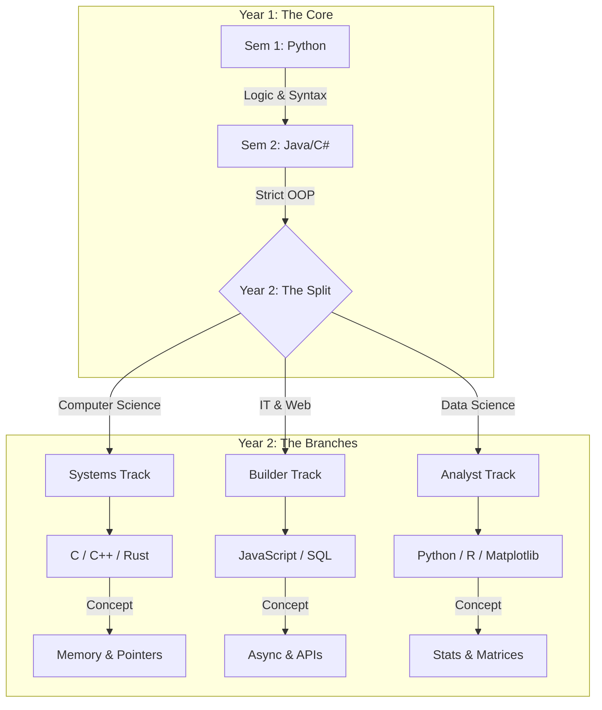

***Context:** I studied Computer Engineering and now serve as a Head of IT hiring developers. I have seen the gap between what universities teach and what the industry needs. This is my take on how we can fix it.*

---

A friend from **USTP (University of Science and Technology of Southern Philippines)** recently asked me a question that brought back memories of my own time as a Computer Engineering (CpE) student:

> *"Most universities in the Philippines still teach C as the first language. Is it still relevant today?"*

The answer is complex, but the reality of how it is taught is simple: **We are doing it wrong.**

I sat through semesters of C and C++ where we never touched a single pointer. I sat through Java classes where we never built a true Object. If you are an educator reading this, I need to be blunt: **Teaching these languages without their core concepts is worse than useless— it is deceptive.**

## The "Zombie" Course

In many Philippine universities, the programming curriculum is a "Zombie"; it looks like a coding class, but it lacks a pulse.

We spend 18 weeks learning `printf`, `for` loops, and `if-else` statements in C. Then the semester ends.
**This is a failure.**

The entire reason C exists is to manage memory. It is the language of the metal. If you teach C without **Pointers** and **Memory Allocation**, you aren't teaching C; you are teaching a very difficult, very fragile calculator. You are forcing students to drive a manual transmission car in first gear for four months. They feel the difficulty, but they never experience the power.

The same happens in **Java**. The soul of Java is **Object-Oriented Programming (OOP)**. It is about architectural discipline, inheritance, and polymorphism. If you teach Java as a procedural language—writing one big `main` function with no custom classes—you are just teaching "Verbose C."

## A Proposal: The "Trunk and Branch" Model

We need to stop using C as a generic "Introduction to Programming." It acts as a filter that fails students before they even understand what building software feels like.

Instead, we should adopt a **Trunk and Branch** model. This unifies the first year (solving the teacher shortage) and specializes only when students are ready.

### Phase 1: The Shared Trunk (Year 1)
*Target: All Students (CS, IT, IS, CpE, Data Science)*
Data Science students benefit immensely from this. Python is their native language. Java/C# is crucial because many Big Data tools (Hadoop, Spark) run on the JVM, and understanding strict data types prevents messy data pipelines later.

* **Sem 1: Python (The Hook)**
    * **Goal:** Logic and Algorithms.
    * **Why:** Python reads like English. Students can focus on the *logic* of the loop rather than the syntax of the semicolon. It builds confidence.
* **Sem 2: Java or C# (The Discipline)**
    * **Goal:** Strict OOP.
    * **Why:** Now that they know how to code, teach them how to *architect*. But here is the rule: **If you aren't teaching Classes and Objects by Week 4, you are moving too slow.**

### Phase 2: The Divergence (Year 2+)
*Target: Career Specialization*
While CS students go "down" to the hardware (C/Pointers) and IT students go "out" to the user (Web/JS), Data Science students go "lateral" into Math and Matrices.

Once the foundation is strong, the majors should split into three distinct paths.

**A. The Systems Track (CS / CpE)**
* **Focus:** C, C++, Rust, Assembly.
* **Why:** These students are building the engines. They need to manage memory manually. They need Pointers.

**B. The Builder Track (IT / Web / IS)**
* **Focus:** JavaScript, TypeScript, SQL, React/Vue.
* **Why:** These students are building products for humans. They need to manage state, APIs, and user interfaces. Pointers are a distraction here.

**C. The Analyst Track (Data Science)**
* **Focus:** Advanced Python (Pandas/NumPy), R, SQL.
* **Why:** These students aren't building apps or engines; they are modeling reality. Instead of learning *Pointers* (Memory addresses), they should learn *Vectorization* (Matrix math).

## Why "C" Belongs in Year 2
For Computer Science and CpE majors, C is non-negotiable. They must understand the machine. But moving it to Year 2 changes the dynamic:
 * Maturity: The students are no longer fighting the concept of a variable. They know how to code.
 * Focus: You don't waste 8 weeks on loops. You start Day 1 with Memory Management.
 * No More "Hollow" C: You can finally teach the dangerous, powerful parts of the language because the students are ready to handle the weapon.

## A Note to Faculty
If you are teaching C, teach Pointers. If you are teaching Java, teach OOP.
If the curriculum doesn't allow enough time to reach those topics, then change the language. Switch to Python or JavaScript. Don't waste the student's tuition on a "Foundation" course that doesn't actually pour the concrete.

