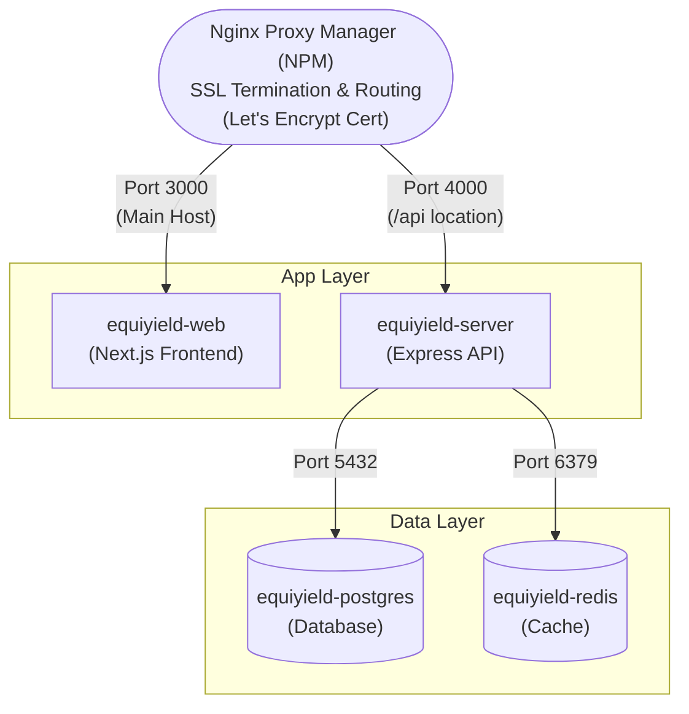

I just deployed **EquiYield v1.0.0**, a complete cooperative savings and loan management system built with modern web technologies. It's live at [equiyield.sanchez.ph](https://equiyield.sanchez.ph) and ready for demo!

## What is EquiYield?

EquiYield is a full-stack web application designed to manage cooperative operations including member contributions, loan applications, dividend distributions, and financial record-keeping. Think of it as a complete digital solution for small to medium-sized cooperatives or credit unions.

### Live Demo

**Admin Access:** [https://equiyield.sanchez.ph/admin/login](https://equiyield.sanchez.ph/admin/login)
- Email: `admin@equiyield.local`
- Password: `Admin@123456`

**Member Portal:** [https://equiyield.sanchez.ph/member/login](https://equiyield.sanchez.ph/member/login)
- Email: `juan.delacruz@demo.com`
- Password: `Member@123`

*(4 other demo members available, all use same password)*

## Tech Stack

I built this using a modern, production-ready stack:

### Frontend
- **Next.js 15** - React framework with App Router
- **Tailwind CSS** - Utility-first styling
- **TypeScript** - Type safety throughout

### Backend
- **Express.js** - REST API server
- **Prisma ORM** - Type-safe database queries
- **PostgreSQL 16** - Relational database
- **Redis 7** - Caching and session management
- **JWT + bcrypt** - Secure authentication

### Infrastructure
- **Docker** - Containerization
- **Nginx Proxy Manager** - SSL termination & reverse proxy
- **OCI Ampere** - ARM64 cloud instance (Always Free tier!)
- **Portainer** - Container management
- **Let's Encrypt** - Free SSL certificates

## Key Features

### For Administrators

✅ **Member Management** - Create members, track shares, control eligibility  
✅ **Contribution Recording** - Multiple payment methods with audit trail  
✅ **Loan Processing** - Approve/reject applications, track payments  
✅ **Dividend Distribution** - Bulk payouts with pro-rata calculation  
✅ **Co-maker Tracking** - Loan guarantor management  
✅ **Expense Management** - Track operational costs  
✅ **Profit Pool** - Annual profit allocation with Redis caching  
✅ **Archive System** - Historical data management  


*The EquiYield Administrator Dashboard providing a high-level overview of cooperative health.*

### For Members

✅ **Self-Service Dashboard** - View shares, loans, dividends  
✅ **Loan Application** - Apply online with co-maker selection  
✅ **Transaction Ledger** - Complete financial history  
✅ **Payment Tracking** - See loan amortization and payments  
✅ **Password Management** - Secure password updates  


*The self-service Member Portal allowing users to track their own finances.*

## The Deployment Journey

Deploying to production wasn't just a smooth `git push` - it was a learning experience! Here are the key challenges I solved:

### Challenge 1: Docker on ARM64

**Problem:** Alpine Linux images missing build tools for Prisma native binaries.

**Solution:** Switched from `node:18-alpine` to standard `node:18` Debian-based images. Simplified to single-stage builds (10-16 lines each).

```dockerfile
FROM node:18
WORKDIR /app
COPY apps/server/package*.json ./
RUN npm install
COPY apps/server/ ./
RUN npx prisma generate
RUN npx tsc
EXPOSE 4000
CMD npx prisma migrate deploy && node dist/server.js
```

### Challenge 2: Special Characters in Passwords

**Problem:** Database passwords with `+`, `/`, `=` breaking Prisma's URL parser (P1013 error).

**Solution:** Generate passwords with hex encoding instead of base64:

```bash
# Wrong - produces special chars
openssl rand -base64 32

# Correct - pure hex
openssl rand -hex 32
```

### Challenge 3: HTTP 525 SSL Errors

**Problem:** Containers couldn't reach through Nginx Proxy Manager.

**Solution:** Both `server` and `web` containers needed to be on NPM's external network:

```yaml
services:
  server:
    networks:
      - equiyield-network
      - net  # NPM's external network
  web:
    networks:
      - equiyield-network
      - net  # NPM's external network

networks:
  net:
    external: true
```

### Challenge 4: API Routing

**Problem:** Frontend receiving HTML instead of JSON from API calls.

**Solution:** NPM needs a **Custom Location** to route `/api` separately:

1. Main proxy host: `equiyield.sanchez.ph` → `equiyield-web:3000`
2. Custom location: `/api` → `equiyield-server:4000`

Also fixed the environment variable:

```env
# Wrong - causes /api/api double paths
NEXT_PUBLIC_API_BASE_URL=https://equiyield.sanchez.ph/api

# Correct
NEXT_PUBLIC_API_BASE_URL=https://equiyield.sanchez.ph
```

### Challenge 5: TypeScript Compilation

**Problem:** Prisma field names in seed script didn't match schema.

**Solution:** Always use exact field names from `schema.prisma`:

```typescript
// Wrong
loan.principal_amount

// Correct (from schema)
loan.principal
loan.monthlyRateBps
loan.monthlyAmortization
```

## Architecture Overview

I designed a containerized microservices architecture orchestrated by Docker Compose.



## Demo Data

The demo includes:
- 1 admin account
- 5 member accounts with varying share counts
- 10 contribution records
- 3 loans (PENDING, RELEASED, PAID statuses)
- 2 loan payments
- 3 historical dividend payouts

Reset script available for daily auto-refresh via cron.

## Cost Analysis

Running on **OCI Always Free Tier**:

- ✅ 1 Ampere ARM64 instance (4 OCPUs, 24GB RAM) - **FREE**
- ✅ 200GB Block Storage - **FREE**
- ✅ 10TB monthly data transfer - **FREE**

**Total Monthly Cost: $0**

## Key Takeaways

### What Worked Well

1. **Prisma ORM** - Type-safe queries with excellent developer experience
2. **Docker Compose** - Simple orchestration for 4 services
3. **Portainer Git Sync** - Auto-deploy on git push
4. **Next.js Standalone** - Minimal production footprint
5. **Redis Caching** - Fast dividend calculations

### Lessons Learned

1. **Avoid special characters in credentials** - Use hex generation for URL-safe passwords
2. **Network configuration is critical** - Containers must be on reverse proxy's network
3. **Test on target architecture early** - ARM64 has different build requirements
4. **Document as you go** - Session logs saved hours of debugging
5. **Simple is better** - Single-stage Docker builds are easier to maintain

## What's Next?

For v1.1.0, I'm considering:
- Email notifications for loan approvals
- CSV export for financial reports
- Mobile-responsive dashboard improvements
- Audit log for all admin actions
- Two-factor authentication

## Try It Out!

Visit [equiyield.sanchez.ph](https://equiyield.sanchez.ph) and explore the demo. The admin panel gives full access to all features, while member accounts show the user experience.

**Links:**
- 🌐 Live Demo: [equiyield.sanchez.ph](https://equiyield.sanchez.ph/admin/login)
- 💻 GitHub: [github.com/tildemark/EquiYield](https://github.com/tildemark/EquiYield)
- 📚 Documentation: See README, ADMIN_GUIDE, and DEPLOYMENT docs

## Questions?

Feel free to explore the code, open issues, or fork for your own projects. The codebase is available under the EquiYield Free Software License for personal, educational, and non-commercial use. For commercial implementations or consulting services, please refer to the commercial licensing details in the repository.

---

**Tech Tags:** #NextJS #TypeScript #Prisma #Docker #PostgreSQL #Redis #Express #OCI #DevOps #FullStack
